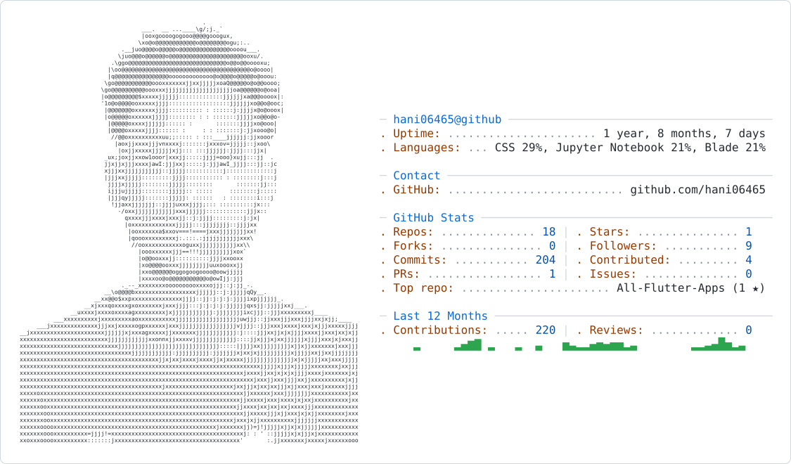

<picture>
  <source media="(prefers-color-scheme: dark)" srcset="dark_mode.svg">
  <source media="(prefers-color-scheme: light)" srcset="light_mode.svg">
  
</picture>

  

  

### 🚀 About Me

Backend &amp; ML Engineer specializing in robust Laravel APIs, intelligent machine learning systems, and cross-platform Flutter applications.

🔭 &nbsp;I'm currently working on **Integrating ML models into scalable Laravel backend services**  
🌱 &nbsp;I'm currently learning **Advanced MLOps &amp; state management patterns in Flutter**  
👯 &nbsp;I'm looking to collaborate on **Open-source Laravel packages &amp; cross-platform Flutter tools**  
💬 &nbsp;Ask me about **Laravel API design, ML model deployment, Flutter UI development**

### 🛠️ Tech Stack

  
  
  
  
  
  
  
  
  
  
  
  
  
  
  
  
  
  
  
  
  
  
  
  
  

### 🔗 Connect With Me

  
  
  

### 📊 GitHub Stats

  
  

### 📈 Contribution Graph

  

### 💭 Dev Quote

  

---

<i>⭐️ From <a href="https://github.com/hani06465">hani06465</a></i>

